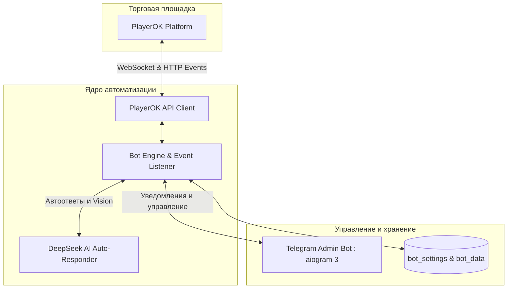

# PlayerOK Telegram Bot

[](https://opensource.org/licenses/MIT)
[](https://python.org/)
[](./Dockerfile)
[](https://github.com/nadaroot/freedeepseek)
[](./CONTRIBUTING.md)

Многофункциональный бот для автоматизации торговли на маркетплейсе PlayerOK с управлением через Telegram и встроенным ИИ Авто-ответчиком на базе DeepSeek.

---

## Архитектура



---

## Возможности

* **ИИ Авто-ответчик (DeepSeek-V3 / R1 / Vision)**:
  * Автоматические ответы покупателям в чатах от имени продавца.
  * Память диалога в рамках сессии.
  * Анализ изображений и скриншотов от покупателей через Vision.
  * Имитация живого набора текста (`delay_seconds`).
  * Фильтрация системных команд (`!продавец`).
* **Автовыдача товаров**:
  * Мгновенная выдача ключей, аккаунтов, ссылок и файлов после оплаты заказа.
* **Автовосстановление товаров**:
  * Автоматическое перевыставление проданных или истекших объявлений.
* **Автоподнятие товаров**:
  * Поднятие лотов по расписанию с учетом интервала и ночного режима.
* **Автовывод средств**:
  * Автоматический вывод баланса на банковские карты, СБП или USDT.
* **Telegram-интерфейс**:
  * Полное управление всеми функциями бота через удобное Inline-меню.
  * Поддержка разделения по темам форума (Forum Topics).
  * Мгновенные уведомления о новых заказах, сообщениях, отзывах и спорах.

---

## Быстрый старт

### Вариант 1: Запуск через Docker Compose (Рекомендуется)

1. Клонируйте репозиторий:
```bash
git clone https://github.com/nadaroot/playeroktgbot.git playerok-bot
cd playerok-bot
```

2. Скопируйте шаблон переменных окружения:
```bash
cp .env.example .env
```

3. Получите сессию PlayerOK (куки) с помощью встроенного мастера:
```bash
python get_cookies.py
```
И заполните `.env` полученными данными и токеном Telegram-бота.

4. Запустите контейнер:
```bash
docker compose up -d
```

---

### Вариант 2: Локальный запуск (Python)

#### Требования
* Python 3.10+
* Google Chrome или Chromium (для получения куки)

1. Создайте виртуальное окружение и установите зависимости:
```bash
python3 -m venv venv
source venv/bin/activate  # На Windows: venv\Scripts\activate
pip install -r requirements.txt
```

2. Запустите мастер авторизации:
```bash
python get_cookies.py
```

3. Запустите бота:
```bash
python bot.py
```

---

## Мастер авторизации (`get_cookies.py`)

Для упрощения получения актуальных Cookie и User-Agent в репозиторий включена консольная утилита:

```bash
python get_cookies.py
```

Она позволяет:
1. Автоматически открыть страницу `https://playerok.com/` в установленном на ПК браузере.
2. Сохранить авторизационные данные в файл `playerok_auth.json`.
3. Автоматически прописать сессию в `bot_settings/config.json`.

---

## Настройка ИИ Авто-ответчика (DeepSeek)

Модуль авто-ответов подключается к [FreeDeepseekAPI](https://github.com/nadaroot/freedeepseek) или любому OpenAI-совместимому эндпоинту.

Настройки в файле `bot_settings/config.json`:
```json
{
  "playerok": {
    "ai_auto_response": {
      "enabled": true,
      "api_base": "http://127.0.0.1:9655/v1",
      "api_key": "sk-freedeepseek",
      "model": "deepseek-chat",
      "thinking_enabled": false,
      "delay_seconds": 2,
      "cooldown": 5,
      "max_history_messages": 8
    }
  }
}
```

---

## Структура проекта

```text
├── bot.py                  # Главная точка входа
├── get_cookies.py          # Мастер получения авторизации
├── requirements.txt        # Зависимости Python
├── Dockerfile              # Docker-сборка
├── docker-compose.yml      # Конфигурация запуска Docker
├── playerokapi/            # Клиент API маркетплейса PlayerOK
├── plbot/                  # Логика автоматизации и ИИ авто-ответчик
│   ├── playerokbot.py      # Обработчики событий и бизнес-логика
│   └── ai_responder.py     # Модуль интеграции с DeepSeek API
├── tgbot/                  # Telegram-бот управления (aiogram 3)
├── core/                   # Утилиты конфигурации и обработчики
└── scripts/                # Вспомогательные скрипты
```

---

## Авторство и благодарности

* Базовая архитектура бота: `alleexxeeyy/playerok-universal`.
* Доработки, адаптация под Docker, мастер авторизации и интеграция DeepSeek Vision AI: `nadaroot`.

---

## Лицензия

Проект распространяется под лицензией MIT. Подробнее см. в файле [LICENSE](./LICENSE).